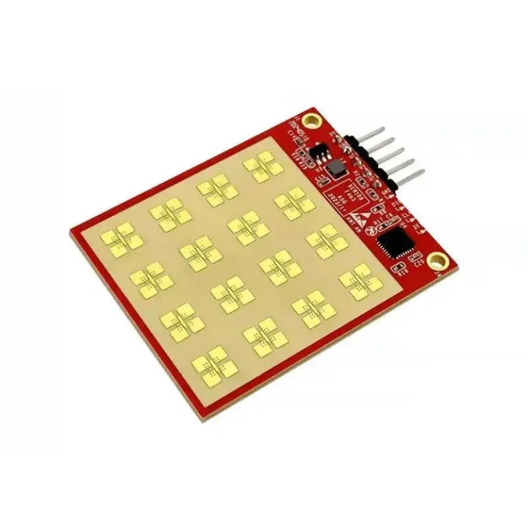

# HLK-LD2413 Water Level Sensor Library



Professional PlatformIO/Arduino library for the Hi-Link HLK-LD2413 24GHz mmWave Water Level Sensor.

## Features
- **Multi-Platform Support**: ESP32, ESP8266, Heltec CubeCell, Arduino.
- **Robust Protocol**: Handles checksums, headers, and protocol parsing.
- **Easy Configuration**: Set distance, report period, and thresholds via simple API.
- **Non-blocking**: Designed to run efficiently in the main loop.

## Installation

### PlatformIO
1. Open `platformio.ini`
2. Add to `lib_deps`:
   ```ini
   lib_deps =
       tekk/HLK-LD2413 @ ^1.0.0
   ```

### Arduino IDE
1. Download ZIP from Releases
2. Sketch -> Include Library -> Add .ZIP Library

## Usage
```cpp
#include "HLK_LD2413.h"

HLK_LD2413 sensor;

void setup() {
    Serial.begin(115200);
    // Initialize with your Serial port (e.g. Serial1 for ESP32)
    sensor.begin(Serial1);
}

void loop() {
    sensor.update();
    if (sensor.hasNewData()) {
        Serial.print("Water Level Dist: ");
        Serial.println(sensor.getDistanceMm());
    }
}
```

## Wiring
| Sensor Pin | ESP32 | ESP8266 | Arduino |
|------------|-------|---------|---------|
| VCC        | 3.3V  | 3.3V    | 3.3V    |
| GND        | GND   | GND     | GND     |
| TX         | RX    | RX      | RX      |
| RX         | TX    | TX      | TX      |

> **Note**: The sensor runs on 3.3V logic. If using a 5V Arduino, use a level shifter.

## CI/CD
This project uses GitHub Actions to verify compilation on every push and tag.
